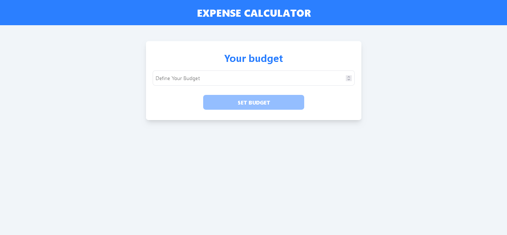
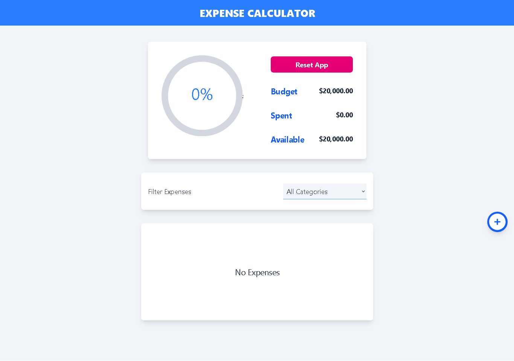
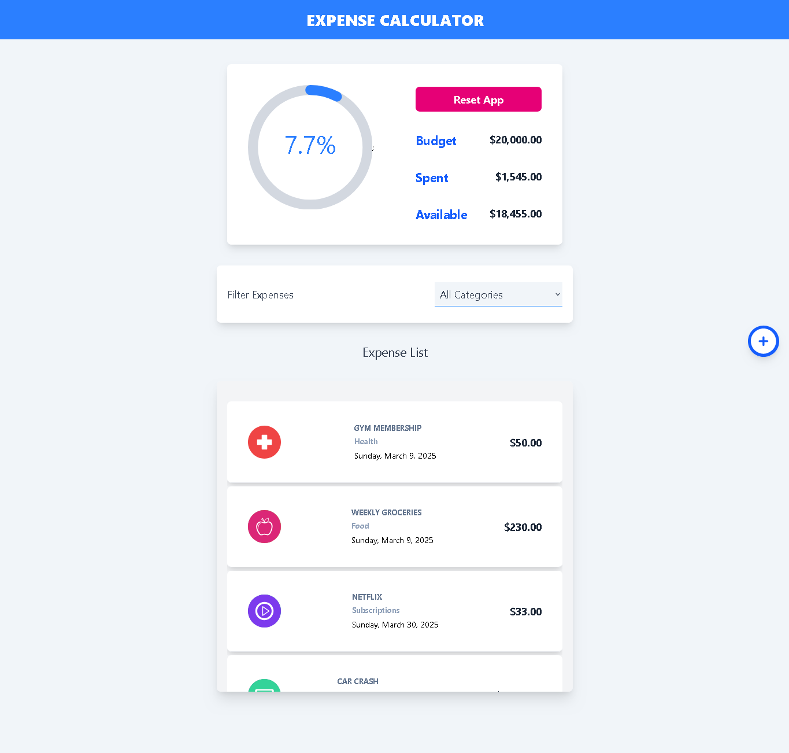

# Expense Calculator

This app helps users track their expenses efficiently, giving them control over their financial activities.

## 🚀 Live Preview
Check out the live demo: [Expense Calculator](https://spendly-tracker.netlify.app/)

## 📸 Screenshots
### Application UI






## 📦 Features
- **Expense Tracking** – Add, edit, and delete expenses.
- **Budget Monitoring** – Set a budget and track your spending.
- **Category Management** – Organize expenses into categories.
- **Date Filtering** – View expenses by date range.
- **Data Persistence** – Uses LocalStorage to retain expenses.
- **Visual Progress** – Displays expense statistics with circular progress bars.
- **Responsive UI** – Fully functional across all devices.

## 🛠️ Technologies Used
- **React (with TypeScript)** – For building a maintainable and scalable UI.
- **React Hooks** – useState, useEffect, useReducer, Context API, and custom hooks.
- **Tailwind CSS** – For rapid and modern styling.
- **Heroicons** – Provides high-quality SVG icons.
- **uuid** – Generates unique IDs for expenses.
- **react-circular-progressbar** – Displays expense tracking visually.
- **Headless UI** – Provides accessible UI components.
- **react-calendar & React-Date-Picker** – Enables date selection.
- **LocalStorage API** – Ensures persistent storage for expenses.

## 📂 Project Structure
```
expense-calculator/
│── public/                     # Static assets (icons, images, etc.)
│── src/                        # Source code
│   ├── components/             # Reusable UI components
│   │   ├── AmountDisplay.tsx   
│   │   ├── BudgetForm.tsx      
│   │   ├── BudgetTracker.tsx   
│   │   ├── ErrorMessage.tsx    
│   │   ├── ExpenseDetail.tsx   
│   │   ├── ExpenseForm.tsx     
│   │   ├── ExpenseList.tsx     
│   │   ├── ExpenseModal.tsx    
│   │   ├── FilterByCategory.tsx
│   ├── context/                # Global state management (React Context API)
│   │   ├── budget-context.tsx  
│   ├── data/                   # Static or mock data
│   │   ├── expense-categories.ts
│   ├── helpers/                 # Utility/helper functions
│   ├── hooks/                   # Custom React hooks
│   │   ├── useBudget.ts         
│   ├── reducers/                # Reducers for state management
│   │   ├── budget-reducer.ts    
│   ├── types/                   # TypeScript types
│   │   ├── index.ts             
│   ├── App.tsx                  # Root component
│   ├── index.css                 # Global styles
│   ├── main.tsx                  # Entry point
│   ├── vite-env.d.ts             # Vite environment definitions
│── package.json                  # Project dependencies & scripts
│── vite.config.ts                 # Vite configuration
│── tsconfig.json                  # TypeScript configuration
│── README.md                      # Documentation
```

## 💻 Setup Instructions

1. Clone the repository:
   ```sh
   git clone https://github.com/Diego3128/expense-calculator
   ```

2. Navigate to the project directory:
   ```sh
   cd expense-calculator
   ```

3. Install dependencies:
   ```sh
   npm install
   ```

4. Start the development server:
   ```sh
   npm run dev
   ```

## 📜 License
This project is open-source and available under the MIT License.

